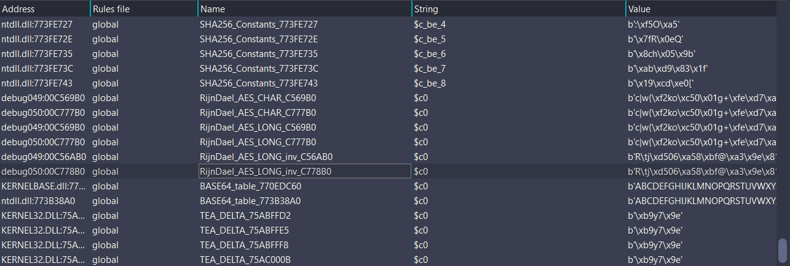
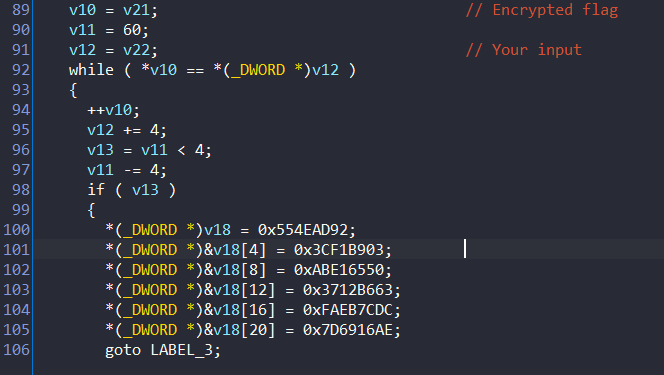

# Matryoshka Doll - 500 pts
* Category: Reversing
* Description: Không có

## Solution
* Bài này đầu tiên load shellcode chứa một binary có header `MZ`, sau đó thực thi thông qua lệnh `call esi` ở cuối dòng hàm `main`. Tiếp tục debug qua các block của shellcode, ta sẽ tới được hàm main cần phân tích. Cuối cùng, dùng thuật toán AES để mã hoá đầu vào rồi so sánh với chuỗi cần tìm.


* Chương trình ở hàm main mới có vẻ như đã sử dụng obfuscation để mã hoá các thông điệp trong hàm printf bằng toán tử logic xor, hình dưới là decode về thông điệp ban đầu.
```asm
debug050:014C144C add     esp, 0Ch
debug050:014C144F mov     dword ptr [esp+100h], 753BC2CBh     
debug050:014C145A mov     dword ptr [esp+104h], 1C85DC64h     
debug050:014C1465 lea     eax, [esp+0E0h]                     
debug050:014C146C mov     dword ptr [esp+108h], 8B840D24h     
debug050:014C1477 mov     dword ptr [esp+10Ch], 5073DA05h     // 
debug050:014C1482 mov     dword ptr [esp+110h], 0F0CA5DFDh    // arr1 = bytes.fromhex("AFE26D57F80FE6DE7D6916AEF0CA5DFD5073DA058B840D241C85DC64753BC2CB")[::-1]
debug050:014C148D mov     dword ptr [esp+114h], 7D6916AEh     // arr2 = bytes.fromhex("AFE26D57F80FE6DE7D6916AEF0CA5DDD6A14BB69EDA47F5173FCFC10004BAC82")[::-1]
debug050:014C1498 mov     dword ptr [esp+118h], 0F80FE6DEh    // out = ""
debug050:014C14A3 mov     dword ptr [esp+11Ch], 0AFE26D57h    // for i in range(len(arr1)):
debug050:014C14AE vmovdqu ymm0, ymmword ptr [esp+100h]        //     out += chr(arr1[i] ^ arr2[i])
debug050:014C14B7 mov     dword ptr [esp+0E0h], 4BAC82h       // print(out)                         
debug050:014C14C2 mov     dword ptr [esp+0E4h], 73FCFC10h     
debug050:014C14CD mov     dword ptr [esp+0E8h], 0EDA47F51h    
debug050:014C14D8 mov     dword ptr [esp+0ECh], 6A14BB69h     
debug050:014C14E3 mov     dword ptr [esp+0F0h], 0F0CA5DDDh
debug050:014C14EE mov     dword ptr [esp+0F4h], 7D6916AEh
debug050:014C14F9 mov     dword ptr [esp+0F8h], 0F80FE6DEh
debug050:014C1504 mov     dword ptr [esp+0FCh], 0AFE26D57h
debug050:014C150F vpxor   ymm0, ymm0, ymmword ptr [esp+0E0h]
debug050:014C1518 vmovdqa ymmword ptr [esp+0E0h], ymm0
debug050:014C1521 push    eax                                 // # Input your flag: 

debug050:00AA1562 mov     dword ptr [esp+0E0h], 1B54B09Ch
debug050:00AA156D mov     dword ptr [esp+0E4h], 79E9FC03h
debug050:00AA1578 mov     dword ptr [esp+0E8h], 0E3F06A4Ah
debug050:00AA1583 mov     dword ptr [esp+0ECh], 7015B525h
debug050:00AA158E mov     dword ptr [esp+0F0h], 97AB319Bh
debug050:00AA1599 mov     dword ptr [esp+0F4h], offset unk_77473880
debug050:00AA15A4
debug050:00AA15A4 loc_AA15A4:                             ; CODE XREF: debug050:00AA172B↓j
debug050:00AA15A4 mov     dword ptr [esp+100h], 753BC2CBh   //
debug050:00AA15AF lea     eax, [esp+0E0h]                   // arr1 = bytes.fromhex("97AB319B7015B525E3F06A4A79E9FC031B54B09C")[::-1]
debug050:00AA15B6 mov     dword ptr [esp+104h], 1C85DC64h   // arr2 = bytes.fromhex("F0CA5DFD5073DA058B840D241C85DC64753BC2CB")[::-1]
debug050:00AA15C1 mov     dword ptr [esp+108h], 8B840D24h   // out = ""
debug050:00AA15CC mov     dword ptr [esp+10Ch], 5073DA05h   // for i in range(len(arr1)):
debug050:00AA15D7 mov     dword ptr [esp+110h], 0F0CA5DFDh  //     out += chr(arr1[i] ^ arr2[i])
debug050:00AA15E2 mov     dword ptr [esp+114h], 7D6916AEh   // print(out)                         
debug050:00AA15ED mov     dword ptr [esp+118h], 0F80FE6DEh
debug050:00AA15F8 mov     dword ptr [esp+11Ch], 0AFE26D57h
debug050:00AA1603 vmovdqu ymm0, ymmword ptr [esp+100h]
debug050:00AA160C mov     dword ptr [esp+0F8h], 0F80FE6DEh
debug050:00AA1617 mov     dword ptr [esp+0FCh], 0AFE26D57h
debug050:00AA1622 vpxor   ymm0, ymm0, ymmword ptr [esp+0E0h]
debug050:00AA162B vmovdqa ymmword ptr [esp+0E0h], ymm0
debug050:00AA1634 push    eax                               // # Wrong length of flag

debug050:00AA16D8 loc_AA16D8:                             ; CODE XREF: debug050:00AA16E7↓j
debug050:00AA16D8 mov     eax, [ecx]                        // Sau khi mã hoá AES thành công, chuỗi output được lưu vào thanh ghi eax
debug050:00AA16DA cmp     eax, [edx]                        // so sánh với chuỗi flag bị mã hoá với chuỗi eax trên, nếu sai thì nhảy tới block loc_AA1730
debug050:00AA16DC jnz     short loc_AA1730                  
debug050:00AA16DE add     ecx, 4 
debug050:00AA16E1 add     edx, 4
debug050:00AA16E4 sub     esi, 4
debug050:00AA16E7 jnb     short loc_AA16D8                  // while(index < 64){đoạn lặp so sánh từng ký tự để check}
debug050:00AA16E9 mov     dword ptr [esp+0E0h], 554EAD92h   // arr1 = bytes.fromhex("7D6916AEFAEB7CDC3712B663ABE165503CF1B903554EAD92")[::-1]
debug050:00AA16F4 mov     dword ptr [esp+0E4h], 3CF1B903h   // arr2 = bytes.fromhex("7D6916AEF0CA5DFD5073DA058B840D241C85DC64753BC2CB")[::-1]
debug050:00AA16FF mov     dword ptr [esp+0E8h], 0ABE16550h  // out = ""
debug050:00AA170A mov     dword ptr [esp+0ECh], 3712B663h   // for i in range(len(arr1)):
debug050:00AA1715 mov     dword ptr [esp+0F0h], 0FAEB7CDCh  //     out += chr(arr1[i] ^ arr2[i])
debug050:00AA1720 mov     dword ptr [esp+0F4h], 7D6916AEh   // print(out)                       # You get the flag!!!
debug050:00AA172B jmp     loc_AA15A4                        // nhảy tới block `loc_AA15A4`, lấy giá trị đó là `arr2` để xor với `arr1`

debug050:014C1730 loc_14C1730:                            ; CODE XREF: debug050:014C16DC↑j
debug050:014C1730 mov     dword ptr [esp+120h], 554EAD92h
debug050:014C173B lea     eax, [esp+120h]
debug050:014C1742 mov     dword ptr [esp+124h], 72EAAE13h   //
debug050:014C174D mov     dword ptr [esp+128h], 0A5AA2343h  // arr1 = bytes.fromhex("5073DA0FA5AA234372EAAE13554EAD92")[::-1]
debug050:014C1758 mov     dword ptr [esp+12Ch], 5073DA0Fh   // arr2 = bytes.fromhex("5073DA058B840D241C85DC64753BC2CB")[::-1]
debug050:014C1763 movaps  xmm1, xmmword ptr [esp+120h]      // out = ""
debug050:014C176B mov     dword ptr [esp+0E0h], 753BC2CBh   // for i in range(len(arr1)):
debug050:014C1776 mov     dword ptr [esp+0E4h], 1C85DC64h   //    out += chr(arr1[i] ^ arr2[i])
debug050:014C1781 mov     dword ptr [esp+0E8h], 8B840D24h   // print(out)                       
debug050:014C178C mov     dword ptr [esp+0ECh], 5073DA05h   
debug050:014C1797 pxor    xmm1, xmmword ptr [esp+0E0h]      
debug050:014C17A0 movaps  xmmword ptr [esp+120h], xmm1
debug050:014C17A8 push    eax                               // # You wrong...
```

* Thông qua các block của hàm main, ta dễ dàng thấy được chương trình nhận input 64 bytes, sau đó kiểm tra độ dài của input để đi vào hàm check flag
```c
char *__fastcall check_flag(_BYTE *a1, char *a2)
{
  char v2; // al
  unsigned int v4; // ebx
  char v5; // cl
  char *result; // eax
  char v7; // ch
  char v8; // dl
  char v9; // dh
  char v10; // [esp+9h] [ebp-3h]

  v2 = *a2;
  v4 = 4;
  a1[13] = a2[13];
  v5 = a2[14];
  *a1 = v2;
  a1[1] = a2[1];
  a1[2] = a2[2];
  a1[3] = a2[3];
  a1[4] = a2[4];
  a1[5] = a2[5];
  a1[6] = a2[6];
  a1[7] = a2[7];
  a1[8] = a2[8];
  a1[9] = a2[9];
  a1[10] = a2[10];
  a1[11] = a2[11];
  a1[12] = a2[12];
  result = a1 + 13;
  a1[14] = v5;
  a1[15] = a2[15];
  do
  {
    v7 = *(result - 1);
    v8 = result[1];
    v9 = result[2];
    v10 = *result;
    if ( (v4 & 3) == 0 )
    {
      v10 = byte_C777B0[(unsigned __int8)result[1]];
      v7 = byte_C777B0[(unsigned __int8)*result] ^ byte_C779B0[v4 >> 2];
      v8 = byte_C777B0[(unsigned __int8)result[2]];
      v9 = byte_C777B0[(unsigned __int8)*(result - 1)];
    }
    ++v4;
    result[3] = v7 ^ *(result - 13);
    result[4] = v10 ^ *(result - 12);
    result[5] = v8 ^ *(result - 11);
    result[6] = v9 ^ *(result - 10);
    result += 4;
  }
  while ( v4 < 0x2C );
  return result;
}
```
Sử dụng plugin `FindCrypt`, ta có thể kết luận sơ bộ hàm check này chính là AES, ngoài ra dựa vào pesudo-code của hàm check flag thì mình nhận thấy nó mã hoá theo từng block một nên mình đoán nó sử dụng mode CBC:

* Quay trở lại hàm main, chúng ta nhận thấy rằng sau khi mã hoá input với key là `lanlefthustbksec` nằm ở phần đầu, chương trình sẽ load `encrypted flag` để so sánh với input đã được xử lý:

* iv:
```c
 if ( strlen(v22) == 64 )
  {
    sub_16E1000(v16, v20.m128i_i8);
    v17[0] = 0x3020100;                         // iv
    v4 = v22;
    v17[1] = 0x7060504;
    v5 = v17;
    v17[2] = 0xB0A0908;
    v17[3] = 0xF0E0D0C;
    ..................
    ..................
```
* Tới đây ta có thể decrypt được rồi, script solve ở đây: 
* FLAG: `BKSEC{31dd8a365525ad47983c9ad675575de9d72f0bd7c17002ff759247073589eec2}`

# END.
