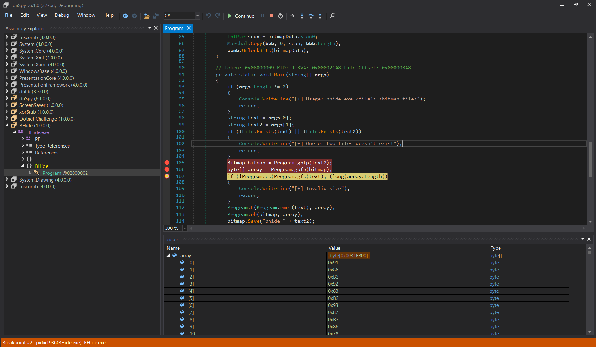

# BHide

Attachments
* [bhide.exe](./BHide.exe)
* [bhide-sample.bmp](./bhide-sample.bmp)

> Steganography images in Reversing without guessing.

## Solution

- Mấu chốt nằm ở hàm `h()`, hàm đó sẽ lấy 8 byte để thực hiện mã hoá file bitmap, tiếp đến hàm sẽ khởi tạo `array` để nén file flag vào và tiến hành mã hoá.
- Đặt breakpoint ở dưới đây, ta sẽ thu được mảng cần decrypt.

```c#
Bitmap bitmap = Program.gbfp(text2);
byte[] array = Program.gbfb(bitmap);
if (!Program.cs(Program.gfs(text), (long)array.Length))
```


File solve mình để đây cho bạn nào cần:
[solve](solve.py)
