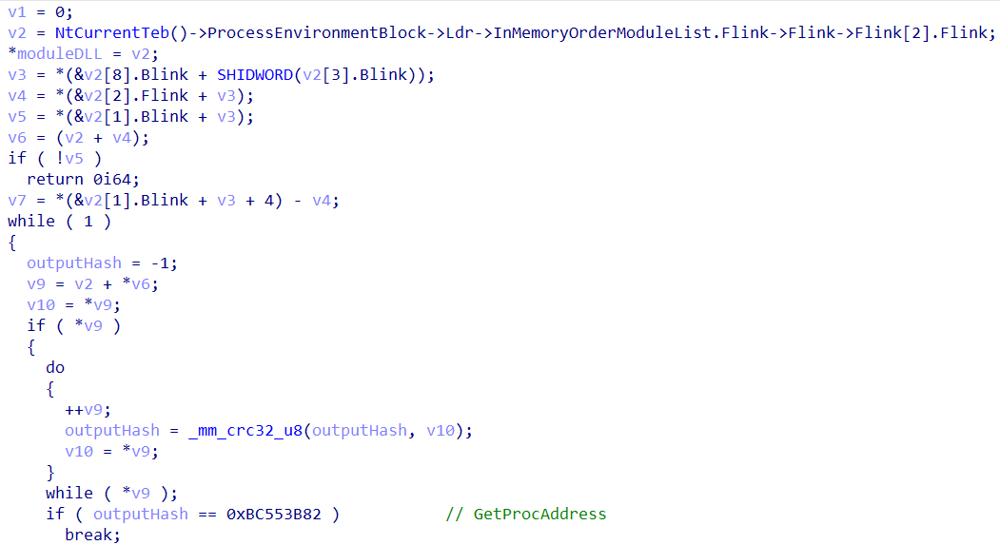
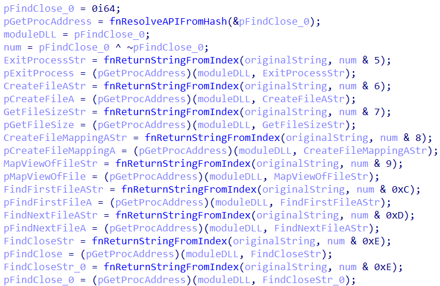
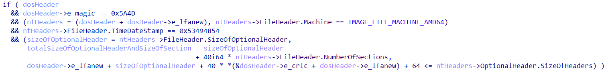
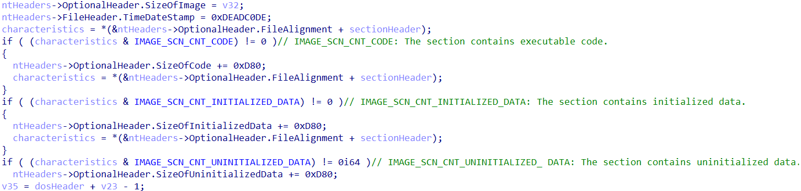
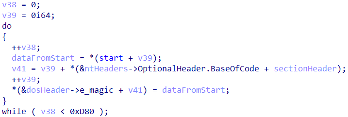
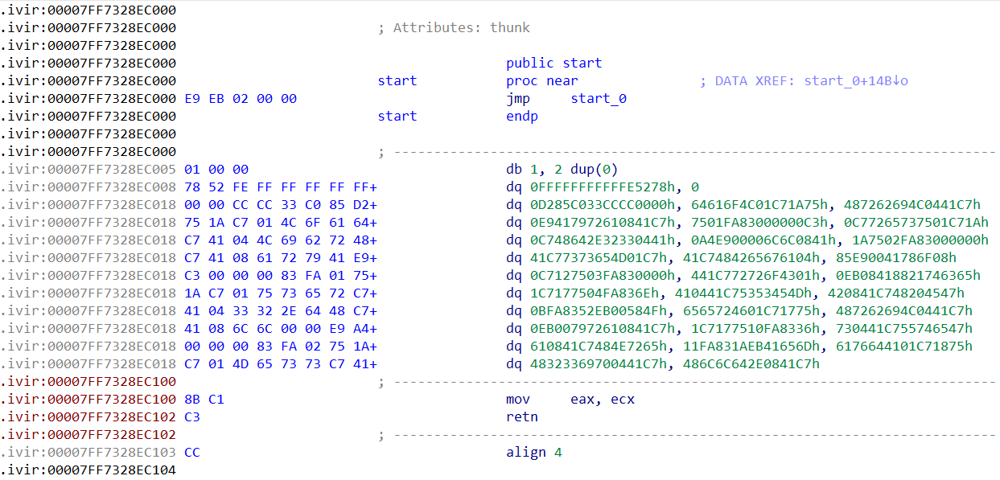
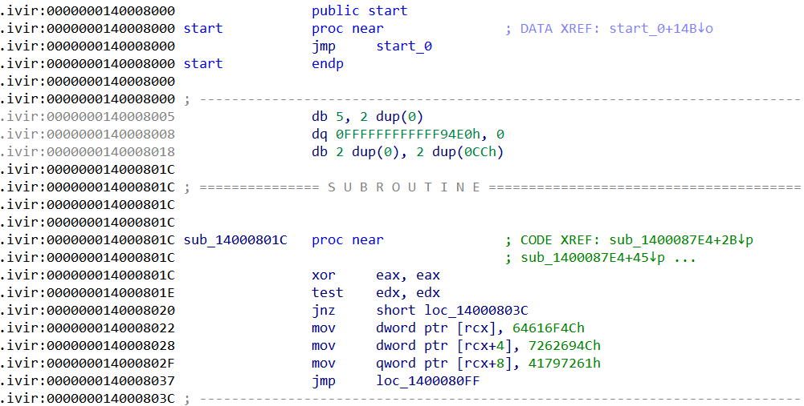
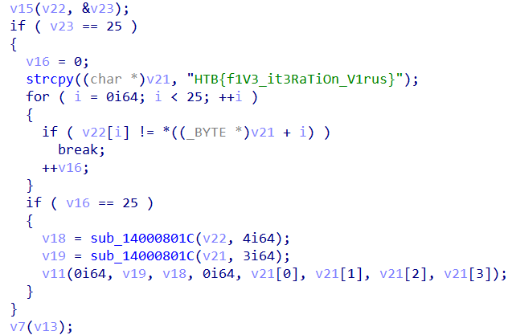

# Hack The Box - rev_iterativevirus

## Mục lục

Bài viết này sẽ trình bày phân tích tập tin có tên ```HELLO_WORLD_INFECTED_!!!.exe``` từ giải Hack The Box CTF.

- Luồng hoạt động của tập tin
- Phân tích
- Giải pháp

## 1. Luồng hoạt động của tập tin

<figure style="text-align: center;">
  
  <figcaption style="font-style: italic;">Hình 1. Sơ đồ lây nhiễm của tập tin để có thể hiển thị flag</figcaption>
</figure>

## 2. Phân tích

Khi thực thi, mã độc sử dụng kỹ thuật ```API Hashing``` với mục đích phân giải hàm ```GetProcAddress```. Hàm này có chức năng kích chạy các API khác để chuẩn bị quá trình lây nhiễm tập tin thực thi được chỉ định.

<figure style="text-align: center;">
  
  <figcaption style="font-style: italic;">Hình 2. Đoạn mã phân giải API GetProcAddress thông qua hash được chỉ định</figcaption>
</figure>

<figure style="text-align: center;">
  
  <figcaption style="font-style: italic;">Hình 3. Đoạn mã có chức năng giải mã các API cần thiết thông qua hàm fnReturnStringFromIndex</figcaption>
</figure>

Sau đó, tập tin trên rà quét các tập tin có phần mở rộng ```.exe``` để tiến hành lây nhiễm đoạn mã vào bên trong tập tin thực thi được chỉ định. Quá trình lây nhiễm được thực hiện như sau:

- Bước 01: Mã độc mở tập tin thực thi được chỉ định để lấy kích thước ban đầu của tập tin, sau đó mã độc mở rộng kích thước tập tin lên ```0xd80``` bytes.

- Bước 02: Mã độc kiểm tra thông tin header của tập tin thực thi, trong đó giá trị của ```TimeDateStamp``` phải bằng ```0x53494854```.

- Bước 03: Mã độc tạo section mới có tên ```.ivir```, sau đó chỉnh sửa các thông số trong cấu trúc tập tin PE nhằm cập nhật section mới. Sau khi tạo mới section xong, mã độc cập nhật thông tin section bao gồm: số lượng section, SizeOfImage và TimeDateStamp.

- Bước 04: Mã độc sao chép toàn bộ đoạn mã từ hàm ```start``` vào vùng section mới.

- Bước 05: Lúc này, mã độc tiến hành giải mã dữ liệu từ section mới. Cuối cùng, mã độc tăng số lần lây nhiễm để kết thúc quá trình lây nhiễm.

<figure style="text-align: center;">
  
  <figcaption style="font-style: italic;">Hình 4. Đoạn mã có chức năng kiếm tra thông tin PE Header của tập tin thực thi được chỉ định</figcaption>
</figure>

<figure style="text-align: center;">
  
  <figcaption style="font-style: italic;">Hình 5. Đoạn mã có chức năng cập nhật thông tin section mới bao gồm thêm thuộc tính cho section được tạo</figcaption>
</figure>

<figure style="text-align: center;">
  
  <figcaption style="font-style: italic;">Hình 6. Đoạn mã có chức năng sao chép đoạn mã vào section mới</figcaption>
</figure>

<figure style="text-align: center;">
  
  <figcaption style="font-style: italic;">Hình 7. Đoạn mã hiển thị các byte code của hàm start</figcaption>
</figure>

<figure style="text-align: center;">
  
  <figcaption style="font-style: italic;">Hình 8. Đoạn mã có chức năng giải mã đoạn mã từ section và cập nhật số lần lây nhiễm</figcaption>
</figure>

## 3. Giải pháp

Quan sát luồng hoạt động của tập tin và kết hợp quá trình phân tích cho thấy, để khiến cho mã độc giải mã ra flag thì số lần lây nhiễm của mã độc phải bằng ```05``` và mỗi lần lây nhiễm thì mã độc sẽ sử dụng các key khác nhau thông qua đoạn switch/case nhằm giải mã ra flag. Dưới đây là cách giải của bài này:

- Bước 01: Ta lấy 01 tập tin exe bất kỳ và chỉnh sửa giá trị trong trường ```TimeDateStamp``` bằng 0x53494854 nhằm đảm bảo tập tin được chỉ định sẽ bị lây nhiễm thành công.

- Bước 02: Ta kích chạy tập tin ban đầu (HELLO WORLD INFECTED!!!.exe) để lây nhiễm tập tin EXE sau khi chỉnh sửa, sau đó ta sử dụng tập tin bị lây nhiễm đó để lây nhiễm tập tin EXE khác và lặp lại cho đến khi mà ta thấy số lần lây nhiễm bằng 05 trên IDA. Lúc này, ta có thể thấy được flag nằm ở hàm tại địa chỉ 0x1400087E4.

<figure style="text-align: center;">
  
  <figcaption style="font-style: italic;">Hình 9. Tại địa chỉ 0x140008005, ta thấy được số lần lây nhiễm bằng 05, nghĩa là đã xong vòng đời lây nhiễm để hiển thị flag.</figcaption>
</figure>

<figure style="text-align: center;">
  
  <figcaption style="font-style: italic;">Hình 10. Flag hiển thị tại hàm có địa chỉ 0x1400087E4</figcaption>
</figure>
