# RE - MalwareAnalysis (HolaCTF 2025)

## Mục lục
1. [Sơ đồ hoạt động](#1-sơ-đồ-hoạt-động)
2. [Phân tích tập tin Initializer.exe (Phần 01)](#2-phân-tích-tập-tin-initializerexe-phần-01)<br>
2.1. [API Hashing](#21-api-hashing)<br>
2.2. [Chức năng của tập tin Initializer.exe (Phần 01)](#22-chức-năng-của-tập-tin-initializerexe-phần-01)
3. [Phân tích tập tin laskdqu_txt_shellcode_stage2.bin](#3-phân-tích-tập-tin-laskdqu_txt_stage2bin)<br>
3.1. [API Hashing](#31-api-hashing)<br>
3.2. [Chức năng của tập tin laskdqu_txt_stage2.bin](#32-chức-năng-của-tập-tin-laskdqu_txt_stage2bin)
4. [Phân tích tập tin Initializer.exe (Phần 02)](#4-phân-tích-tập-tin-initializerexe-phần-02)<br>
4.1. [Chức năng của tập tin Initializer.exe (Phần 02)](#41-chức-năng-của-tập-tin-initializerexe-phần-02)<br>
4.2. [Giải mã dữ liệu](#42-giải-mã-dữ-liệu)
5. [Phân tích tập tin laskdqu_txt_stage3.bin](#5-phân-tích-tập-tin-laskdqu_txt_stage3bin)<br>
5.1. [Junk code](#51-junk-code)<br>
5.2. [Chức năng của tập tin laskdqu_txt_stage3.bin](#52-chức-năng-của-tập-tin-laskdqu_txt_stage3bin)
6. [Lời giải](#6-lời-giải)
7. [Tham khảo](#7-tham-khảo)

## 1. Sơ đồ hoạt động

Đề bài cung cấp 03 tập tin: Initializer.exe, config.ini, capture.pcapng. Dưới đây là sơ đồ hoạt động của chương trình:

<table>
  <tr>
    <td align="center">
      
      <br>
      <em>Hình 1. Sơ đồ hoạt động của chương trình</em>
    </td>
  </tr>
</table>

- Bước (01): Luồng hoạt động bắt đầu từ tập tin Initializer.exe. Khi thực thi, tập tin EXE giải mã và kích chạy tập tin laskdqu.txt (1). Tập tin TXT trên được lưu vào đường dẫn thư mục %TEMP%.
- Bước (02), (03): Tập tin laskdqu.txt khi thực thi, có chức năng giải mã tập tin config.ini và gửi dữ liệu giải mã về tập tin Initializer.exe.
- Bước (04): Tập tin Initializer.exe kích chạy ứng dụng MS StickyNotes, đóng vai trò là tập tin mồi nhử.
- Bước (05), (06): Tập tin Initializer.exe tiến hành giải nén, nhả và kích chạy tập tin laskdqu.txt (2). Tập tin này có chức năng chụp màn hình và gửi về máy chủ C&C.

## 2. Phân tích tập tin Initializer.exe (Phần 01)

### 2.1 API Hashing

Chương trình sử dụng hàm ```mw_resolve_api_from_hash``` để phân giải địa chỉ của các API và địa chỉ của các module. Dưới đây là 02 thuật toán hash được sử dụng gồm có:

* Thuật toán hash dành cho module

```c++
v16 = 0;
v17 = 1;
if ( v15 > 0 )
{
    length_dll_name = v15;
    do
    {
        v19 = *base_dll_name++;
        v17 = (v19 + v17) % 0xFFF1;
        v16 = (v17 + v16) % 0xFFF1;
        --length_dll_name;
    }
     while ( length_dll_name );
}

v20 = 0;
v21 = 0;
do
{
    v22 = 0x53D25A33u >> (v21 + 0x18);
    v21 -= 8;
    v20 += 8;
    v17 = (v22 + v17) % 0xFFF1;
    v16 = (v17 + v16) % 0xFFF1;
}
while ( v20 < 0x20 );

if ( (v17 | (v16 << 0x10)) == hash_module_compare )
{
    // Trả về địa chỉ của module tương ứng với hash được chỉ định.
}
```
* Thuật toán hash dành cho API

```c++
function_name_va = module_base + *address_of_names_rva;
LODWORD(function_name) = *function_name_va;
for ( k = 0x10; function_name; k = (k + v34) ^ (v35 + v33) )
{
    ++function_name_va;
    v33 = ((function_name + k) >> 1) & 0x7FFFFF80;
    v34 = function_name + ((function_name + k) >> 8);
    v35 = (function_name + k) << 7;
    LODWORD(function_name) = *function_name_va;
}
if ( ((k + (k ^ 9)) ^ ((k + (k ^ 9)) << 0xD)) + (((k + (k ^ 9)) & 0x7FFC0 ^ ((k + (k ^ 9u)) >> 0xD)) >> 6) == hash_function_compare )
{
    return (module_base + address_of_functions_rva[(*address_of_name_ordinals_rva + module_base)]);
}
```

### 2.2 Chức năng của tập tin Initializer.exe (Phần 01)

Đầu tiên, tập tin Initializer.exe khởi tạo 01 ```Salt``` thông qua 07 hàm check. Trong đó, ```Salt``` gồm 08 ký tự, bao gồm ký tự ```0```, ```1``` và phần tử thứ 07 được xác định là ```1```. Các hàm check này nằm trong hàm ```__scrt_common_main_seh(void)``` và được thực thi trước hàm Main. Dưới đây là ảnh chụp và chức năng của các hàm check:

<table>
  <tr>
    <td align="center">
      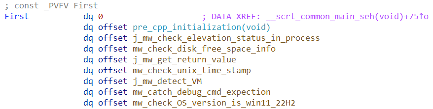
      <br>
      <em>Hình 2. Danh sách các hàm check được dùng để khởi tạo Salt</em>
    </td>
  </tr>
</table>

- Hàm ```mw_check_elevation_status_in_process```: kiểm tra tiến trình hiện tại có quyền administrator hay không.
- Hàm ```mw_check_total_disk_free_space```: kiểm tra tổng dung lượng ổ đĩa C có lớn hơn 100GB hay không.
- Hàm ```mw_get_return_value```: trả về giá trị 1. Tuy nhiên, nếu nhìn flow trên Assembly thì nó có 1 đoạn ```JMP``` luôn bỏ qua đoạn asm trả về giá trị 0.
- Hàm ```mw_check_unix_time_stamp```: kiểm tra timestamp hiện tại trên máy có nhỏ hơn hoặc bằng giá trị ```1747130569``` hay không. Trong đó, giá trị ```1747130569``` khi chuyển sang ngày giờ sẽ là: ```Tuesday, 13 May 2025 10:02:49``` theo múi giờ GMT. Nếu chuyển sang múi giờ GMT +7 sẽ là: ```Thứ 03, ngày 13/05/2025, lúc 17:02:49```.
- Hàm ```mw_detect_VM```: đầu tiên, chương trình kiểm tra sự tồn tại của đường dẫn ```C:\\ProgramData\\Microsoft\\Windows\\Start Menu\\Programs\\StartUp\\agent.pyw```, sau đó kiểm tra môi trường thực thi trên máy tính có dùng máy ảo VirtualBox hoặc VMWare hay không.
- Hàm ```mw_catch_debug_cmd_expection```: kiểm tra chương trình có sử dụng trình debugger hay không. Nếu có, chương trình sẽ trigger hàm ```mw_set_value_to_1``` để ghi giá trị ```1``` vào mảng Salt.
- Hàm ```mw_check_OS_version_is_win11_22H2```: kiểm tra phiên bản hệ điều hành có phải là ```Windows 11 22H2``` hay không.

Sau khi khởi tạo Salt thành công, chương trình gửi Salt vào 01 vùng nhớ chia sẻ (named shared memory) đã được tạo trước đó. Cuối cùng, tập tin Initializer.exe giải mã dữ liệu và lưu với tên ```laskdqu.txt``` tại đường dẵn thư mục %TEMP%. Tôi đổi tên tập tin thành ```laskdqu_txt_stage2.bin``` để phân biệt với các tập tin khác trong quá trình phân tích.

<table>
  <tr>
    <td align="center">
      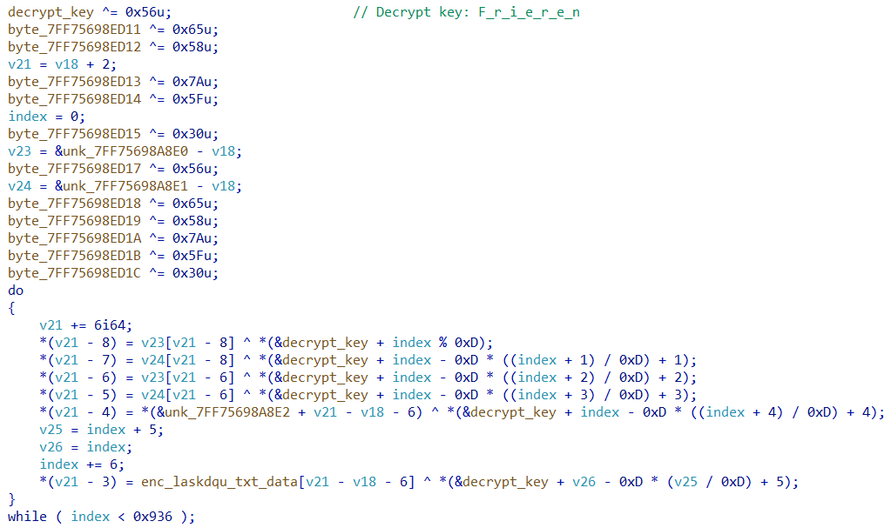
      <br>
      <em>Hình 3. Thuật toán tuỳ chỉnh được dùng để giải mã dữ liệu và lưu với tên laskdqu.txt (1)</em>
    </td>
  </tr>
</table>

## 3. Phân tích tập tin laskdqu_txt_stage2.bin

### 3.1 API Hashing

Thuật toán hash mà chương trình sử dụng kết hợp giữa thuật toán ```Rotate Left 32-bit``` tuỳ chỉnh với thuật toán ```XOR```. Dưới đây là đoạn mã giả biểu diễn thuật toán trên:

```c++
output_hash = 0;
do
{
    idx_func_name = *function_name++;
    output_hash = idx_func_name ^ __ROL4__(output_hash, 6);
}
while ( idx_func_name >= 1 );
```

Trong đó, các hash được lấy từ địa chỉ ```0x400108``` cho đến ```0x400178```. Dưới đây là hình chụp của các hash được sử dụng để resolve ra API.

<table>
  <tr>
    <td align="center">
      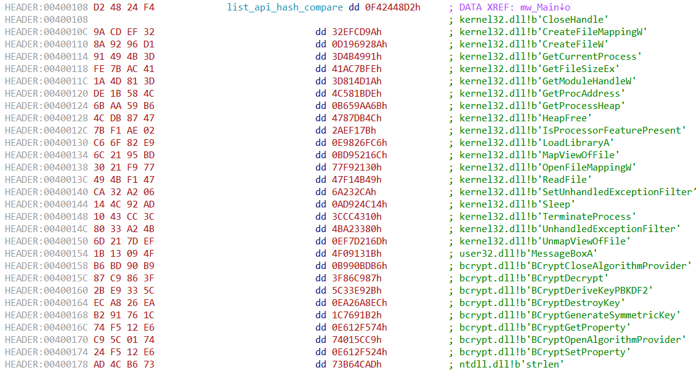
      <br>
      <em>Hình 4. Danh sách các hash được sử dụng để phân giải ra API tương ứng</em>
    </td>
  </tr>
</table>

### 3.2 Chức năng của tập tin laskdqu_txt_stage2.bin

Chức năng chính của tập tin này đó là giải mã tập tin config.ini, sau đó gửi dữ liệu giải mã về tập tin Initializer.exe thông qua vùng nhớ chia sẻ (named shared memory). Cụ thể, chương trình sử dụng thuật toán ```AES-ECB``` từ thư viện ```BCrypt``` để giải mã, trong đó, ```aes_key``` được khởi tạo bằng thuật toán ```SHA256-HMAC``` với chuỗi đầu vào là ```In1t_Sh33sh```, ```Salt``` nhận được từ tập tin Initializer.exe.

<table>
  <tr>
    <td align="center">
      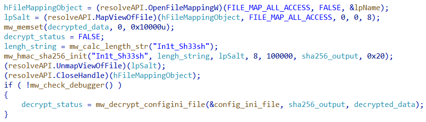
      <br>
      <em>Hình 5. Đoạn mã có chức năng giải mã dữ liệu</em>
    </td>
  </tr>
</table>

<table>
  <tr>
    <td align="center">
      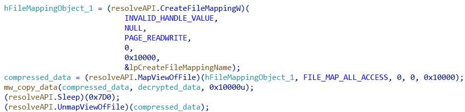
      <br>
      <em>Hình 6. Đoạn mã có chức năng gửi dữ liệu giải mã được về tập tin Initializer.exe</em>
    </td>
  </tr>
</table>

## 4. Phân tích tập tin Initializer.exe (Phần 02)

### 4.1 Chức năng của tập tin Initializer.exe (Phần 02)

Sau khi nhận được dữ liệu từ tập tin laskdqu_txt_stage2.bin, chương trình tiến hành giải nén dữ liệu bằng thuật toán ```LZNT1```. Sau đó, chương trình kích chạy tiến trình ```MS StickyNotes``` thông qua câu lệnh ```open shell:appsfolder\\Microsoft.MicrosoftStickyNotes_8wekyb3d8bbwe!App```. Tiến trình này đóng vai trò là mồi nhử, dùng để đánh lạc hướng người dùng đang mở ứng dụng StickyNotes. Đồng thời, chương trình ghi xuống tập tin ```laskdqu_txt (2)``` vào đường dẫn thư mục %TEMP%, với giá trị là dữ liệu giải nén trước đó và kích thước đầu ra là ```0x10000 bytes```. Cuối cùng, tập tin Initializer.exe kích chạy tập tin ```laskdqu_txt (2)```thông qua API CreateProcessA.

<table>
  <tr>
    <td align="center">
      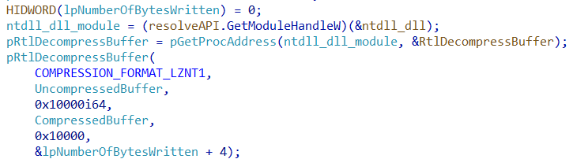
      <br>
      <em>Hình 7. Đoạn mã có chức năng giải nén dữ liệu</em>
    </td>
  </tr>
</table>

<table>
  <tr>
    <td align="center">
      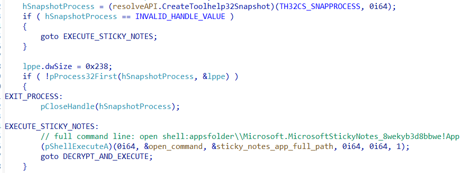
      <br>
      <em>Hình 8. Đoạn mã có chức năng kích chạy tiến trình StickyNotes</em>
    </td>
  </tr>
</table>

### 4.2. Giải mã dữ liệu

Như đã đề cập ở mục [Chức năng của tập tin Initializer.exe (Phần 01)](#22-chức-năng-của-tập-tin-initializerexe-phần-01) và [Chức năng của tập tin Initializer.exe (Phần 02)](#41-chức-năng-của-tập-tin-initializerexe-phần-02), mình phải tìm chính xác được ```Salt```, từ đó mới có thể giải nén dữ liệu thành công.

Mình đã biết ```Salt``` được khởi tạo từ 07 hàm check và mình cũng biết ở vị trí thứ 07 có giá trị là ```1```, từ đó giải mã ra được tập tin tiếp theo. Tuy nhiên, nếu chỉ tập trung phân tích 07 hàm trên để xác định ```Salt```, nó sẽ làm mất thời gian phân tích. Vì vậy, mình đã ```brute-force``` 07 phần tử còn lại trong mảng ```Salt``` bằng cách tận dụng mã giả của chương trình để giải quyết, xét thấy viết lại chương trình bằng C/C++ sẽ giúp mình hiểu rõ hơn cách hoạt động của chương trình, cũng như tránh sai sót trong quá trình brute-force. 

Đây là script để mình tìm giá trị ```Salt``` cũng như lưu tập tin sau khi tìm đúng giá trị: [Brute-force stage2](https://github.com/MrEn1gma/Writeups/blob/main/HolaCTF/2025/MalwareAnalysis/brute_stage2.cpp). Từ đó mình đã tìm được giá trị ```Salt``` là: ```10111011```. Tập tin giải mã thành công mình đổi tên thành ```laskdqu_txt_stage3.bin```.

## 5. Phân tích tập tin laskdqu_txt_stage3.bin

### 5.1 Junk code

Khi phân tích bằng IDA, mình nhận thấy những hàm quan trọng của chương trình đều được chèn các "mã rác" (Junk code), nhằm cản trở quá trình phân tích tĩnh. Để giải quyết chúng, mình đã xác định các bytes "rác", sau đó dùng hàm ```idc.find_binary``` trong IDA Python để tìm kiếm tất cả các pattern nằm trong khoảng địa chỉ được chỉ định. Sau đó dùng hàm ```ida_bytes.patch_byte``` để NOP các bytes rác. Dưới đây là ảnh chụp so sánh 02 đoạn mã trước và sau khi xử lý mã rác:

<table>
  <tr>
    <td align="center">
      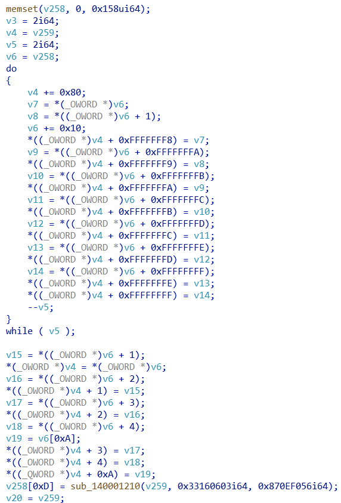
      <br>
      <em>Hình 9. Một phần mã giả ban đầu bị chèn mã rác</em>
    </td>
  </tr>
</table>

<table>
  <tr>
    <td align="center">
      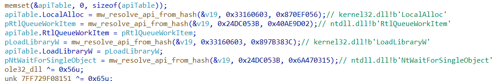
      <br>
      <em>Hình 10. Mã giả sau khi xử lý các đoạn mã rác</em>
    </td>
  </tr>
</table>

Đây là script xử lý mã rác: [kill_junk_code.py](https://github.com/MrEn1gma/Writeups/blob/main/HolaCTF/2025/MalwareAnalysis/kill_junk_code.py)

### 5.2 Chức năng của tập tin laskdqu_txt_stage3.bin

Chức năng chính của tập tin laskdqu_txt_stage3.bin đó là: ```chụp ảnh màn hình máy tính```, sau đó lưu tập tin ảnh vào đường dẫn thư mục %TEMP%. Tiếp đến, tập tin trên đọc nội dung tập tin ảnh để tiến hành mã hoá chúng. Thuật toán mà tập tin laskdqu_txt_stage3.bin sử dụng là ```RC4``` với ```arc4_key``` là ```GetProcAd\x00\x00\x00```, sau đó encode dữ liệu bằng thuật toán ```Base64```. Điều đáng chú ý đó là, hàm ```SystemFunction032``` được sử dụng là một hàm ```undocumented``` có chức năng thực hiện thuật toán RC4.

<table>
  <tr>
    <td align="center">
      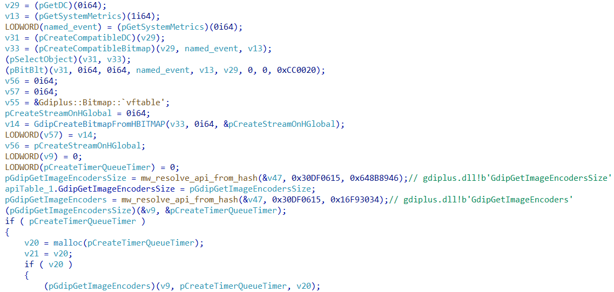
      <br>
      <em>Hình 11. Đoạn mã có chức năng chụp màn hình</em>
    </td>
  </tr>
</table>

<table>
  <tr>
    <td align="center">
      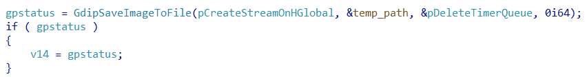
      <br>
      <em>Hình 12. Đoạn mã có chức năng lưu tập tin ảnh vào đường dẫn thư mục %TEMP%</em>
    </td>
  </tr>
</table>

<table>
  <tr>
    <td align="center">
      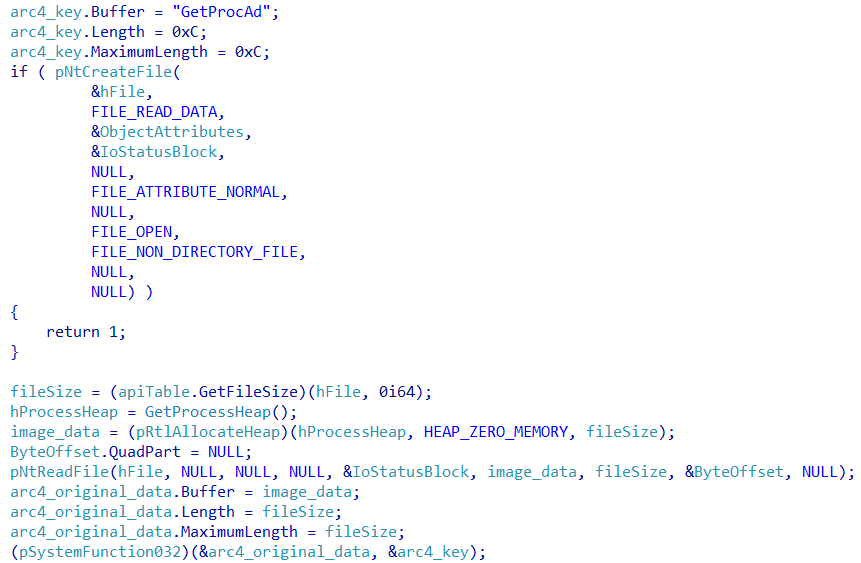
      <br>
      <em>Hình 13. Đoạn mã có chức năng mã hoá dữ liệu ảnh thông qua hàm SystemFunction032</em>
    </td>
  </tr>
</table>

<table>
  <tr>
    <td align="center">
      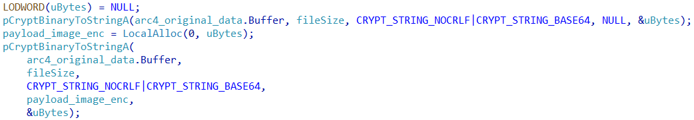
      <br>
      <em>Hình 14. Đoạn mã có chức năng encode dữ liệu bằng thuật toán Base64</em>
    </td>
  </tr>
</table>

Dữ liệu sau khi mã hoá sẽ được gửi về máy chủ C&C. Qua phân tích, mình thu được thông tin cấu hình như sau:
- IP: 192.168.160.135
- Port: 80
- Http method: POST

## 6. Lời giải

Dựa vào chức năng đã đề cập ở mục [Chức năng của tập tin laskdqu_txt_stage3.bin](#52-chức-năng-của-tập-tin-laskdqu_txt_stage3bin), mình có thể xác định được flag sẽ nằm trong tập tin capture.pcapng. Trước khi tiến hành giải mã tập tin ảnh, mình cần tổng hợp lại một số thông tin quan trọng bao gồm:

- Thuật toán sử dụng: RC4 và Base64
- Khoá được sử dụng trong thuật toán RC4: ```GetProcAd\x00\x00\x00```
- IP: 192.168.160.135
- Port: 80
- Http method: POST

Việc mình cần tìm lúc này là chuỗi base64 được ghi lại khi gửi về máy chủ C&C thông qua tập tin capture.pcapng. Dựa vào những thông tin đã tìm được, dễ dàng tìm thấy chuỗi base64 chứa flag:

<table>
  <tr>
    <td align="center">
      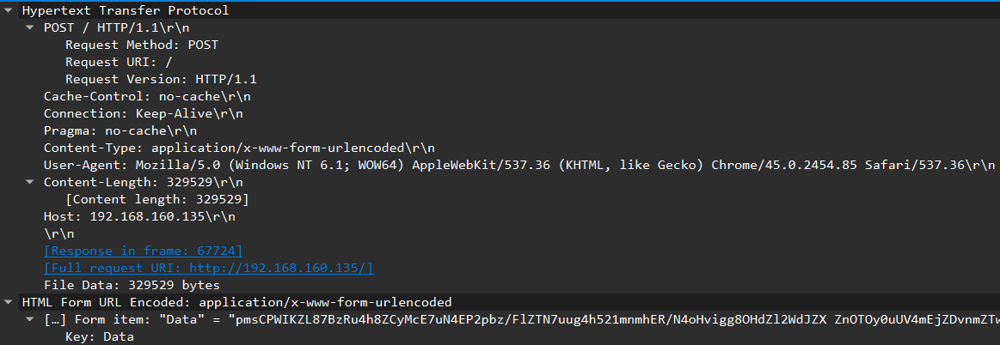
      <br>
      <em>Hình 15. Packet chứa chuỗi base64 thông qua trường Data</em>
    </td>
  </tr>
</table>

Lúc này mình đã có được chuỗi base64 cần tìm, sau đó tiến hành giải mã dữ liệu. Dưới đây là script giải mã:

```python
from base64 import b64decode
from Cryptodome.Cipher import ARC4

data = open("enc_jpg.txt", "rb").read()
arc4_cipher = b64decode(data)
arc4_key = b"GetProcAd\x00\x00\x00"
arc4 = ARC4.new(arc4_key)
out = arc4.decrypt(arc4_cipher)
open("flag.jpg", "wb").write(out)
```

Cuối cùng, mình đã tìm ra được flag: ```HOLACTF{Sub3t3_9@_K1R4Ri}```

<table>
  <tr>
    <td align="center">
      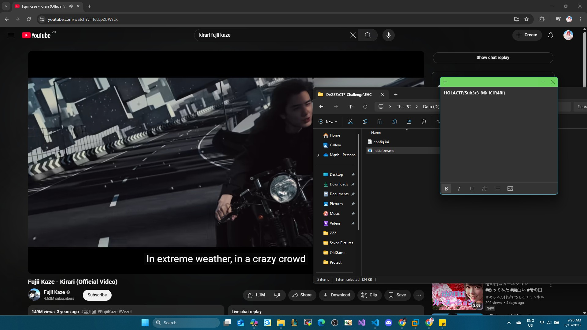
      <br>
      <em>Hình 16. Flag sau khi giải mã</em>
    </td>
  </tr>
</table>

## 7. Tham khảo

Mình có để 03 file .idb của 03 tập tin cho mọi người tham khảo bao gồm:

- Initializer.exe: [Download](https://github.com/MrEn1gma/Writeups/blob/main/HolaCTF/2025/MalwareAnalysis/Initializer.exe.i64)
- laskdqu_txt_stage2.bin: [Download](https://github.com/MrEn1gma/Writeups/blob/main/HolaCTF/2025/MalwareAnalysis/laskdqu_txt_stage2.bin.idb)
- laskdqu_txt_stage3.bin: [Download](https://github.com/MrEn1gma/Writeups/blob/main/HolaCTF/2025/MalwareAnalysis/laskdqu_txt_stage3.bin.i64)
