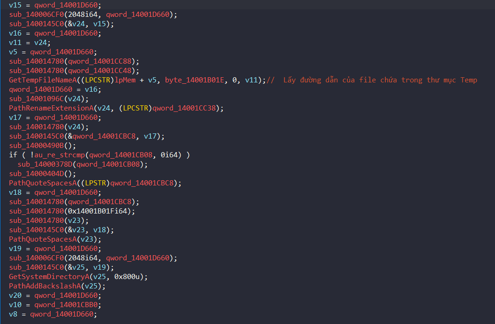

# Old School - Author: 0xTowel

## TL;DR
* File bị packed bằng UPX.
* Sử dụng trình compiler để biên dịch ngôn ngữ Batch Windows, khi chạy chương trình nó sẽ lưu ở thư mục Temp và thực thi tại đó với format là XXXX.bat.
* File sau khi nhận được là 1 file Batch đã bị Obfuscated. Giải mã chúng sau đó dịch ngược cái algo sẽ ra được flag.

## Decompile Batch Script
- Phân tích trên IDA, ở dòng cuối cùng của hàm Main - hàm `sub_140004F26`. Chúng ta thấy được hàm API `GetTempFileNameA`: lấy đường dẫn của file batch đã được giải nén ở thư mục Temp và `PathRenameExtensionA` sẽ đổi tên thư mục có dạng là XXXX.tmp. Ta có thể mở sẵn thư mục Temp và chạy file exe đó để lấy được source file batch.



## Deobfuscate Batch
- Trích 1 đoạn obfuscate sau:

```batch
17 %TdapAUb%g%dhVMYqNn%%uPKf%o%kMZB%%ZMSLo%t%QnP%%ych%o%mOxct% :PPbpns
18 %zqMVuok%s%WJdPO%%bIx%e%jyWBag%%OlBbP%t%mLDQOd% xtgBUH=%QQjwJ%
19 %dZmgR%s%NQzllu%%DevWh%e%yTjEz%%jfTT%t%bmszVvzS% UHO=%QQjwJ%
20 %qawyAK%s%sJH%%APe%e%cNVxmbWK%%hAl%t%oPYMbA% TVSB=%bsOug%
21 %ntV%s%qUOJg%%tQMtO%e%ZUrnWBO%%fKVylod%t%gQZDjC% AuwMeP=%vQM%
22 %ftGYzo%s%GAj%%KGK%e%LXNTNpbK%%eNLgLv%t%kIOEWm% kldwNz=%QQjwJ%
23 %EdVkBvM%s%ahTbWvhT%%trzLcagy%e%NWbnhSiM%%WUi%t%UkHc% ZTGlAYXA=%vQM%
24 :PPbpns
25 %FqEE%@%VZDGRTPY%%rhn%e%pWIHHRS%%UfFEEjP%c%xjVVJLF%%TLNiiW%h%lGP%%dclS%o%GKmVQg% %wGxqcvay%o%XuAJXC%%VQdFdh%f%aclaQXa%%KzCiF%f%icCiP%
26 %tLiHQGfd%g%nuJjhQMa%%LzxqTsnF%o%JuSWYMc%%xIYrpK%t%ZSduLD%%YTdT%o%wdDz% :tWFWEhoA
27 %DdS%s%KUrYfM%%OwYM%e%kkHZndEp%%XLQPKSfF%t%iJCWEE% mfiSsq=%iEU%
28 %UEY%s%xlZGpL%%OvkotUvn%e%JfxngMhH%%dJPlaFC%t%BLw% XYTJabu=%vQM%
29 %wMMpE%s%cTKsTbm%%Enrg%e%FzOFqRc%%FJmrNUjG%t%NLx% BNfbXe=%QQjwJ%
30 :tWFWEhoA
31 %pEJAF%t%MGhBpfxw%%FpnSDhrs%i%vySniw%%kBKSqof%t%bDwxj%%attWFyu%l%CvtG%%lxZkBYQ%e%MhcO% %oaAwbuTO%U%XolyJkly%%oTkXUFC%M%TgUjwI%%mbnxAW%D%oCeLqQg%%Rike%-%SxM%%RPdDnn%C%gLD%%vHHm%T%HAeunatZ%%KzUe%F%PEXnBu% : %hzLAf%O%bjyYp%%hOFn%l%BaZp%%qNm%d%agbT% %OLv%S%uhAXGQT%%Iloe%c%bVTThCP%%wFkfY%h%bwiOay%%gzxJ%o%ZDRlvWts%%Lptshz%o%MlsO%%FtMbHm%l%JLgz% : %eAiJ%R%WjxMNzPX%%PfyaHZJ%i%xKYdWc%%wPY%n%mZGiNzo%%tEGlhnF%g%FKz%%RtfXbm%Z%XgxumR%%VAz%e%DxTgdYl%%CKb%r%OayuJEpN%%doxwTmOD%0%bmQ% %KfBwqV%T%FTVcA%%lgblj%e%EayLQ%%eEVCjY%a%UUkVX%%Eua%m%UIgRV%
32 %GzRuluaP%g%jEwuM%%psaBqfGe%o%IBcUziJN%%KrbaqCnA%t%eNYaiK%%RqvdJ%o%NKZ% :eTzFcK
```

- Ý tưởng: Ở dòng đầu tiên ta thấy được có khá nhiều biến có dạng %[A-Za-z]% mục đích làm cho đoạn code trở nên khó đọc hơn. Nhưng nếu ta thử bỏ hết các biến "rác" đi, ta sẽ ra được `goto :PPbpns` (hàm goto .LABEL trong batch được sử dụng để nhảy tới 1 label đã được chỉ định). Như vậy ở dòng 14 nó sẽ nhảy tới dòng 21 và từ dòng 15 đến dòng 20 nó sẽ KHÔNG làm gì hết - hay chúng ta có thể kết luận được đó chính là đoạn code rác (Unused code). Tuy nhiên, ở dòng 28, chúng ta thử decode ra sẽ được đoạn: `title UMD-CTF : Old School : RingZer0 Team`, điều này chúng tỏ rằng đoạn code này chắc chắn là thật. Nếu nhìn 1 cách tổng quát hơn, chúng ta sẽ thấy được một quy luật: các đoạn code nằm ở giữa Label (bắt đầu bằng dấu hai chấm) và Label (bắt đầu bằng các biến %xxxx%) thì chính là code thật. Sau đó ta có thể loại bỏ các Label đi vì nếu để ý kỹ thì các Label luôn được nhảy theo dạng mắt xích. Và cuối cùng là lọc ra các biến rác là bước cuối cùng của quá trình Deobfuscate.
- Thực hiện: Mình sẽ dùng module `Regex` để thực hiện theo ý tưởng trên vì ban đầu mình đã cố gắng tìm tool để deobfuscate nhưng không được. Đây là Deobfuscate script của mình các bạn có thể tham khảo: 
