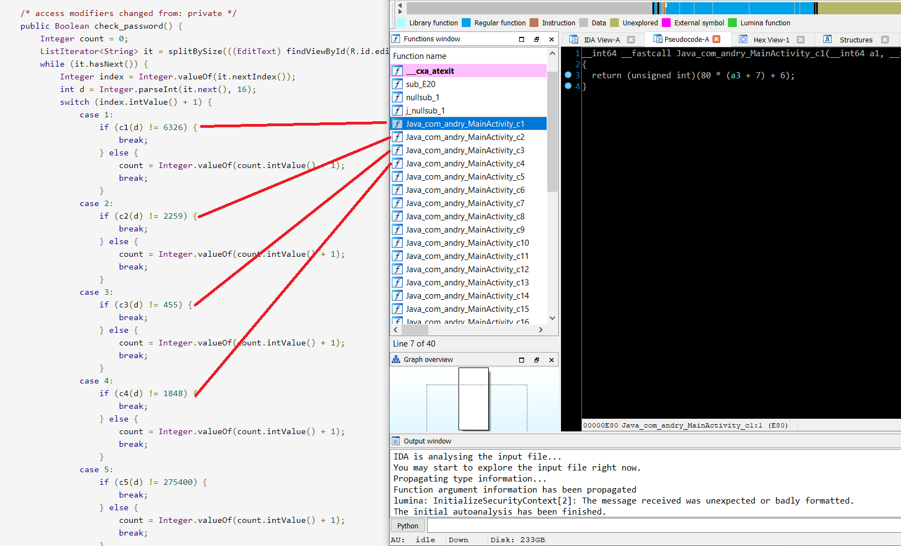

# Author: @madt1m
# Challenge file: andry.apk
# Description:
> So, I am developing this app to store my secret flag in a weird way. It's not complete though... but you have your tools to overcome that, right?

# Introduction:
> Well, today is a perfect day to find a new techniques and i chose m0leCon to practice reversing Android :D. In this challenge, i took about 30 mins to complete. :"))))))))))
> 
> OK, lets work.

I hate install Android Studio, because of lag when i started with Visual Studio Code, so i decided to use `decompiler.com`. After decompiled it, we can view the result after decompiled successful:

I'll choose `OnCreate()` and call it's main function.
```java
    /* access modifiers changed from: protected */
    public void onCreate(Bundle savedInstanceState) {
        super.onCreate(savedInstanceState);
        setContentView((int) R.layout.activity_main);
        ((Button) findViewById(R.id.button2)).setOnClickListener(new View.OnClickListener() {
            public void onClick(View view) {
                if (MainActivity.this.check_password().booleanValue()) {
                    Toast.makeText(MainActivity.this.getApplicationContext(), "Yes!", 0).show();
                    DynamicLoaderService.startActionLoad(MainActivity.this.getApplicationContext(), ((EditText) MainActivity.this.findViewById(R.id.editPassword1)).getText().toString());
                    return;
                }
                Toast.makeText(MainActivity.this.getApplicationContext(), "No...", 0).show();
            }
        });
    }
```
In `check_passsword()`, we can see that the program will take input 32 characters to generate password, each of case is match each of functions which are loaded in library `libandry-lib.so`, so we can make an equations to get answers.


Now we turning back to main function, look at this class `DynamicLoaderService`.
```java
    private void handleActionFoo(String password_key) {
        try {
            byte[] byteArray = IOUtils.toByteArray(getApplicationContext().getAssets().open("enc_payload"));
            XORDecrypt(byteArray, password_key);
            String response = DynamicDecode(byteArray, "decrypt", "EASYPEASY");
            Log.i("FLAG: ", "ptm{" + response + "}");
        } catch (IOException e) {
            e.printStackTrace();
        }
    }

    private void XORDecrypt(byte[] data, String key) {
        throw new UnsupportedOperationException("NOT IMPLEMENTED YET! PURE GUESSING!");
    }
```
This class will be taken the password and use `XORDecrypt()` to xor with data of file `enc_payload`, here's a script:
```python
cipher = open("enc_payload", "rb").read()
output_file = []
for i in range(len(cipher)):
    output_file.append(cipher[i] ^ key[i % 32]) # key is the password
    
open("dump.dex", "wb").write(bytearray(output_file))
```
After decode this, we gave a file which has a header: `dex`, load to `exeinfoPE`, we can confirm that is a `DEX` file. So that we continue decompile it and here's a result:
```java
package p000;

/* renamed from: Inner */
public class Inner {
    public static String decrypt(String str) {
        int i = 0;
        String upperCase = "NUKRPFUFALOXYLJUDYRDJMXHMWQW".toUpperCase();
        String str2 = "";
        for (int i2 = 0; i2 < upperCase.length(); i2++) {
            str2 = str2 + ((char) ((((upperCase.charAt(i2) - str.charAt(i)) + 26) % 26) + 65));
            i = (i + 1) % str.length();
        }
        return str2;
    }

    public static String encrypt(String str, String str2) {
        int i = 0;
        String upperCase = str.toUpperCase();
        String str3 = "";
        for (int i2 = 0; i2 < upperCase.length(); i2++) {
            str3 = str3 + ((char) ((((upperCase.charAt(i2) - 'A') + (str2.charAt(i) - 'A')) % 26) + 65));
            i = (i + 1) % str2.length();
        }
        return str3;
    }

    public void keep() {
    }
}
```
# Final
Turning back to the class `DynamicLoaderService`, after generated file `.dex` success, this function `handleActionFoo` will call `decrypt()` function and use this magic key `EASYPEASY` to get the flag. I resolve to use this code to write a script :D.
> The final solution i save to `Andry/solve1.java`

# Conclusion
> This is a good challenge for medium level, i've learnt a little bit from their technique. I'm very lucky because i had practiced it in picoCTF 2019 :D
> If you feel my writeup is good, please give me star to made me happy :D :D :D.

Thank you for watching.
